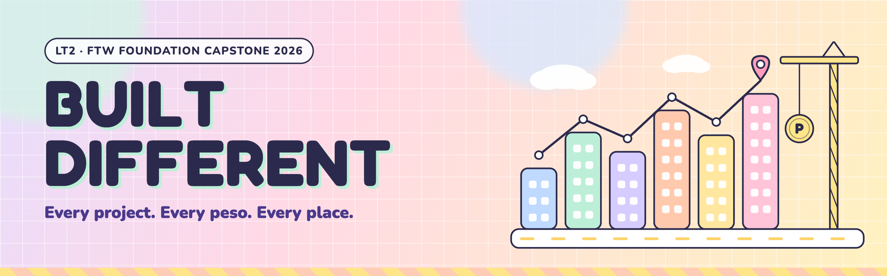
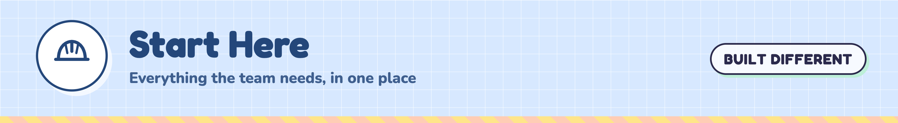
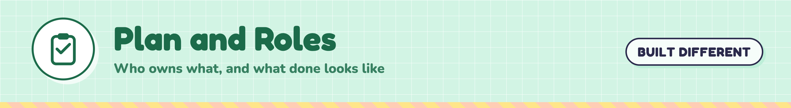
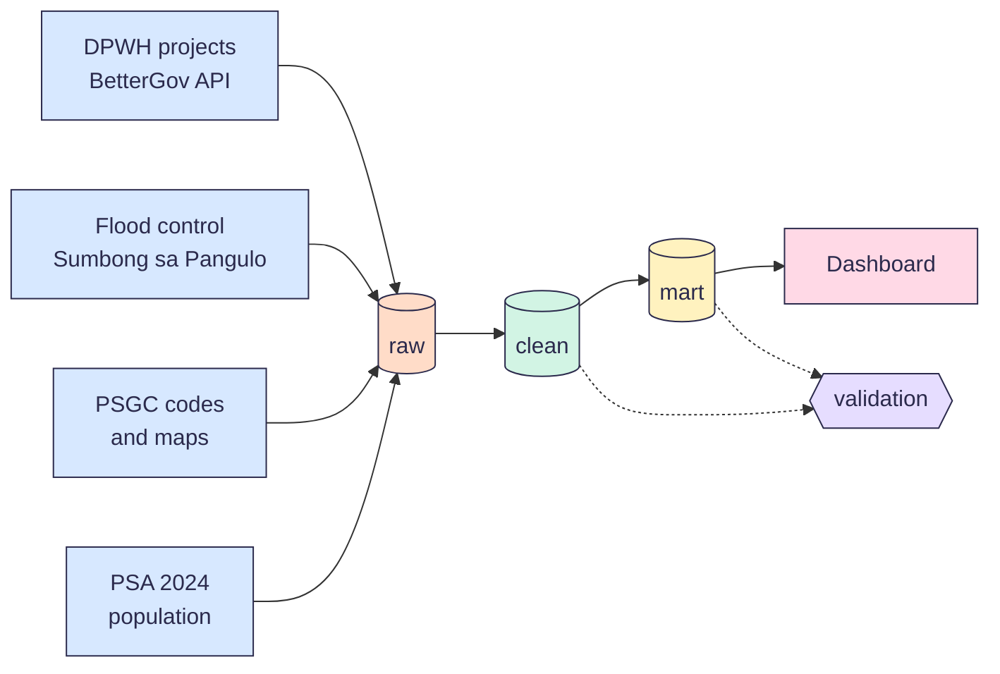
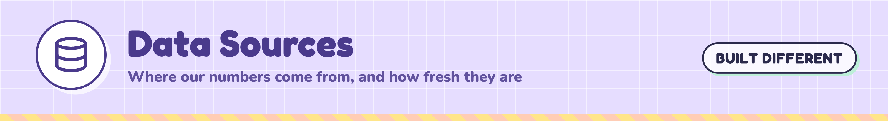
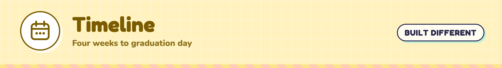
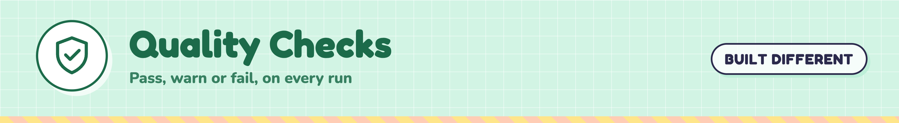
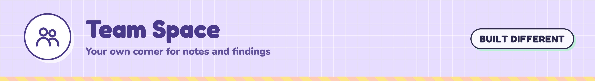

<p align="center">
  
</p>

<p align="center">
  
  
  
  
</p>

<p align="center">
  <b>LT2 · FTW Foundation Data Engineering Track · Capstone 2026</b><br>
  <a href="#-what-we-are-building">What</a> ·
  <a href="#-the-pipeline">Pipeline</a> ·
  <a href="#-data-sources">Data</a> ·
  <a href="#-timeline">Timeline</a> ·
  <a href="#-how-we-work">How we work</a> ·
  <a href="#-the-team">Team</a>
</p>



## 🏗️ What we are building

A data pipeline that follows public works projects in the Philippines from start to finish.

We pull DPWH project data, match every project to a real place, add how many people live there, and check the data at every step. The end result is a dashboard that shows where the money goes, how far each project got, and which places may be left out.

> [!NOTE]
> **Main question (draft):** Where do public works pesos go, and do the projects reach the places with the most people?
>
> We lock the final question with our mentor before the schema is due on Oct 3.

**Questions we want the dashboard to answer**

| # | Question | What it shows |
| :-: | --- | --- |
| 1 | How much went to each region and province? | Total budget and budget per person |
| 2 | Which projects are late or stuck? | Progress and dates by place |
| 3 | Does the money paid match the work done? | Amount paid next to progress |
| 4 | How do flood control projects compare? | Flood control next to other project types |
| 5 | Which places have many people but few projects? | Population next to project count |



## 🧱 The pipeline



| Layer | What happens here |
| --- | --- |
| 🟧 **raw** | Land the data as it comes. No changes. Add the load date. |
| 🟩 **clean** | Fix types and dates, remove duplicates, and give every project a PSGC place code. |
| 🟨 **mart** | Build the tables the dashboard reads, like spending per province and per person. |
| 🟪 **validation** | Run the checks and save the results in one table, so we can prove the data is right. |



## 📚 Data sources

| Source | What we use it for | Link |
| --- | --- | --- |
| DPWH projects (BetterGov API) | Every DPWH project with budget, amount paid, progress, dates, contractor and map point | [api.dpwh.bettergov.ph](https://api.dpwh.bettergov.ph/projects) |
| DPWH Transparency Portal | The official source. We use it to spot-check our numbers. | [transparency.dpwh.gov.ph](https://transparency.dpwh.gov.ph) |
| Sumbong sa Pangulo | Flood control projects | [sumbongsapangulo.ph](https://sumbongsapangulo.ph) |
| PSGC 2Q 2026 (PSA) | Official codes for every region, province, city, town and barangay | [psa.gov.ph/classification/psgc](https://psa.gov.ph/classification/psgc) |
| 2024 Census of Population (PSA) | How many people live in each place | [psa.gov.ph](https://psa.gov.ph) |
| Boundary maps | Match each project's map point to a place | [BetterGov open data](https://data.bettergov.ph/datasets/23) · [HDX](https://data.humdata.org/dataset/cod-ab-phl) |

Each source gets a source card in our team doc: who owns it, how big it is, how often it changes, and what can go wrong.



## 📅 Timeline

| Date | Milestone | Done when |
| --- | --- | --- |
| **Sat, Sep 26** | 🚀 Kickoff | Team, name and leader set |
| **Sat, Oct 3** | 🧩 Schema | Source cards done and the schema is reviewed |
| **Sat, Oct 10** | 🟨 Gold marts | Clean and mart tables pass their checks. Team photoshoot. |
| **Sat, Oct 17** | 📊 Dashboards and judging | Dashboard done, cert exam, judged presentation |
| **Sat, Oct 24** | 🎓 Graduation | Repo and README are final |

Every week: mentor and SI check-ins from Monday to Wednesday, sponsor check-ins on Thursday or Friday, and one team work day.



## 🤝 How we work

1. Pull `main` before you start.
2. Make a branch named for the work, like `feature/raw-dpwh-projects` or `docs/source-cards`.
3. Commit small changes with clear messages.
4. Open a pull request into `main` and fill in the template.
5. One teammate reviews it. Then Kinah merges.

Read the full rules in [CONTRIBUTING.md](CONTRIBUTING.md). Our tasks live in the Issues tab and on the project board.

**Where things live**

| Place | What goes there |
| --- | --- |
| 💬 Slack | Team chat, the team canvas and quick questions |
| 📱 Viber | Fast pings and reminders |
| 📝 Team Google Doc | Plans, source cards, decisions, meeting notes and the data dictionary |
| 🐙 GitHub | Code, issues and the project board |
| 🧱 Databricks | Notebooks, tables, jobs and the dashboard |

## 🗂️ Repo map

```
built-different-capstone/
├── assets/banners/   team banners
├── pipelines/        Databricks notebooks, one folder per layer
├── docs/             source cards, schema and data dictionary
└── .github/          issue and pull request templates
```



## 💜 The team

| | Name | Role |
| :-: | --- | --- |
| 👑 | Kinah | Team lead |
| 🧱 | Bri | Data engineer |
| 🧱 | Nadine | Data engineer |
| 🧱 | Sam | Data engineer |
| 🧱 | Tricia | Data engineer |

**Mentor:** Carmi · **Support instructor:** Simonee

<p align="center"><sub>Built by team Built Different for the FTW Foundation Data Engineering Track 2026.</sub></p>
