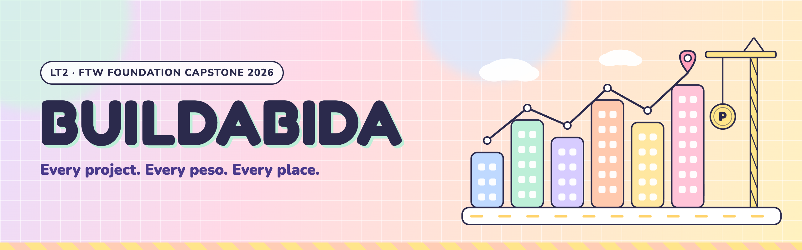
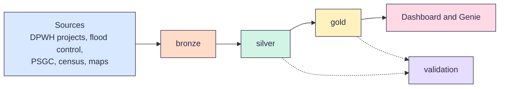

<p align="center">
  
</p>

> **Archived on Oct 1, 2026.** Our team works in [Buildabida/infra-project-monitoring](https://github.com/Buildabida/infra-project-monitoring) now. This repo keeps my first pass from Sep 29, in [pull request #21](https://github.com/czekinah/buildabida-capstone/pull/21). The team version of the bronze loads merged in [#41](https://github.com/Buildabida/infra-project-monitoring/pull/41) on Sep 30.

# Infrastructure Project Monitoring Pipeline

This project tracks public works projects in the Philippines, from the source data to a dashboard. It joins DPWH project records with official place codes (PSGC) and the 2024 census. This lets us see where project money goes, how far each project has gone, and how that compares with the number of people in each place.

Built by team Buildabida (LT2) for the FTW Foundation Data Engineering Track capstone, 2026.

> **Status:** Archived on Oct 1, 2026. The team repo has the current status.

## Who it is for

- People who want to check public works spending in their province or city
- Planners who want to find places with many people but few projects
- Our mentor, support instructor and judges, who need to run and check the pipeline

## Our brief

This is our brief from the FTW capstone kickoff (LT2, Infrastructure Project Monitoring):

> Government infrastructure projects are published through multiple sources with inconsistent geographic references and project classifications. Build a centralized platform for monitoring infrastructure investments.

**Main question:** Where is government infrastructure investment concentrated, what types of projects are being funded, and which areas have relatively low investment compared with population and infrastructure needs?

In short: where does the money go, what kinds of projects get it, and which places get too little for how many people live there?

These smaller questions help us answer it:

1. How much project money went to each region and province, in total and per person?
2. Which projects are late or not moving?
3. Does the amount paid match the reported progress?
4. How do flood control projects compare with other project types?
5. Which places have many people but few projects?

## How it works



| Layer | What it does |
| --- | --- |
| bronze | Keeps each source as it came, plus the load time. No changes. |
| silver | Fixes types and dates, removes duplicates, and gives every project a PSGC code. |
| gold | Holds the gold marts: the facts and dimensions that the dashboard and Genie read. |
| validation | Saves the result of every check. A failed critical check stops the run. |

## Data sources

| Source | What we use it for |
| --- | --- |
| [DPWH projects API](https://api.dpwh.bettergov.ph/projects) by BetterGov.ph | Every DPWH project with budget, amount paid, progress, dates, contractor and map point. About 265,000 projects as of Sep 2026. |
| [DPWH Transparency Portal](https://transparency.dpwh.gov.ph) | The official source. We use it to spot-check the API. |
| [Sumbong sa Pangulo](https://sumbongsapangulo.ph) | Flood control projects, from DPWH |
| [BetterGov flood control projects](https://bettergov.ph/flood-control-projects/table) | The flood control list named in our brief |
| [PSGC 2Q 2026](https://psa.gov.ph/classification/psgc) by PSA | Official codes for 18 regions, 82 provinces, 149 cities, 1,493 towns and 42,010 barangays |
| [2024 Census of Population](https://psa.gov.ph) by PSA | Population of each place |
| [Boundary maps](https://data.humdata.org/dataset/cod-ab-phl) on HDX | Matching each project's map point to a place |

Notes on the sources:

- In the API, `location.province` holds a DPWH district office name, like `Albay 2nd DEO`. It is not a PSGC province. We use the map point and the boundary maps to find the real place.
- Some projects may appear in both the DPWH list and the flood control list. We match them by contract ID so we do not count them twice.

## Data model (draft)

The final schema is due on Oct 3. This is our starting point.

| Table | One row is | Key |
| --- | --- | --- |
| `bronze.dpwh_projects` | One project, as the API returns it | `contract_id` |
| `bronze.flood_control_projects` | One flood control project | `contract_id` |
| `bronze.psgc` | One place in the PSGC list | `psgc_code` |
| `bronze.population_2024` | One place and its 2024 population | `psgc_code` |
| `silver.projects` | One project from any source, with a PSGC code | `contract_id` |
| `gold.dim_place` | One region, province, city or town | `psgc_code` |
| `gold.dim_project_type` | One project type | `project_type_id` |
| `gold.fact_project` | One project | `contract_id` |
| `validation.dq_results` | One check on one column in one run | `run_id`, `table_name`, `column_name`, `check_name` |

## How to run

The full run order is added when the first notebooks are merged.

### Requirements

- A Databricks Free Edition account
- Read access to this repo
- Databricks access to the source links above. See [Known limits](#known-limits).

### Setup

1. In Databricks, open **Workspace** and go to your home folder.
2. Click **Create**, then **Git folder**.
3. Paste `https://github.com/czekinah/buildabida-capstone.git` and click **Create Git folder**.
4. Before you run anything, click the branch name and then **Pull**.

### Run order

| Step | Folder | What it does | Status |
| --- | --- | --- | --- |
| 1 | `pipelines/01_bronze` | Loads each source into `bronze` | Planned |
| 2 | `pipelines/02_silver` | Builds `silver` tables and adds PSGC codes | Planned |
| 3 | `pipelines/03_gold` | Builds the facts and dimensions | Planned |
| 4 | `pipelines/04_validation` | Runs all checks and saves the results | Planned |

## Validation

Every run checks the data before it moves to the next layer.

| Check | Example | If it fails |
| --- | --- | --- |
| Not null | `contract_id` is never empty | Stop the run |
| Unique | One row per `contract_id` in `silver.projects` | Stop the run |
| Row counts | Bronze, silver and gold totals match, after known drops | Stop the run |
| Valid range | `progress` is from 0 to 100 | Flag the row |
| Map point | The point is inside the Philippines | Flag the row |
| Place match | Every project has a PSGC code | Flag and report the match rate |
| Money | `amount_paid` is not more than `budget` | Flag the row |

Results go to `validation.dq_results` with the same columns we used in Week 9: `column`, `data_quality_check`, `failed_rows`, `total_rows`, `percentage` and `status`.

A GitHub Actions check also looks for broken links in our Markdown files on every pull request.

## Decisions

We log each decision with an ID, the options we looked at, and why we picked one. D-02, our main question, is set by our brief. Open decisions right now:

| ID | Question |
| --- | --- |
| D-01 | Which Databricks workspace runs the final pipeline and dashboard? |
| D-03 | How do we match a project to a place: map point, office name, or both? |
| D-04 | How do we handle projects that are in both the DPWH and flood control lists? |

## Using AI tools

We use AI the way FTW taught us: AI-assisted, human-owned. Before we use AI on project work, we pass four gates: data, AI, output and accountability. If any gate fails, we stop. The rules are in [CONTRIBUTING.md](CONTRIBUTING.md).

## Known limits

- Databricks Free Edition only lets notebooks reach trusted websites. If a source is blocked, we download the file and upload it to a Databricks volume, and we note the download date.
- Each of us has our own Free Edition workspace. We share code through this repo, not through one workspace.

## Repo structure

```
.
├── README.md          this file
├── CONTRIBUTING.md    how we branch, review and merge
├── assets/banners/    team images
├── pipelines/         Databricks notebooks, one folder per layer
├── docs/              source cards, schema, data model and decisions
└── .github/           issue and pull request templates, and checks
```

## Team and timeline

Kinah (lead), Bri, Nadine, Sam and Tricia. Mentor: Carmi. Support instructor: Simonee.

Tasks are GitHub issues, and the project board shows who is working on what. Every change goes through a pull request with one review. See [CONTRIBUTING.md](CONTRIBUTING.md).

| Date | Milestone |
| --- | --- |
| Oct 3 | Ingest and model: source cards, PSGC matching and the lakehouse schema |
| Oct 10 | Gold marts: silver and gold tables pass their checks |
| Oct 17 | Dashboard and AI/BI layer. Databricks Associate exam. |
| Oct 24 | Present and defend at the Final Capstone Showcase (judging). Graduation. |
