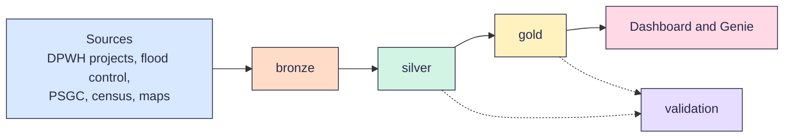

<p align="center">
  
</p>

# Infrastructure Project Monitoring Pipeline

A Databricks pipeline that shows where public works money goes in the Philippines, and which places get too little.

Built by team Buildabida (LT2) for the FTW Foundation Data Engineering Track capstone, 2026.

> [!NOTE]
> We're building this now. The schema is due Oct 3, and judging is Oct 24.

## Why we built it

The government publishes its projects in many places. Each source names places and project types in its own way. So it's hard to see the full picture.

Our brief asks one main question:

> Where is government infrastructure investment concentrated, what types of projects are being funded, and which areas have relatively low investment compared with population and infrastructure needs?

In short: where does the money go, what kinds of projects get it, and which places get too little for how many people live there?

These smaller questions help us answer it:

1. How much project money went to each region and province, in total and per person?
2. Which projects are late or not moving?
3. Does the amount paid match the reported progress?
4. How do flood control projects compare with other project types?
5. Which places have many people but few projects?

## Who it's for

- **People** who want to check public works spending in their province or city
- **Planners** who want to find places with many people but few projects
- **Our mentor, support instructor and judges**, who need to run and check the pipeline

## How it works



Each layer is a schema in our `buildabida` catalog.

| Layer | What it holds |
| --- | --- |
| `bronze` | Each source as it came, plus the load time |
| `silver` | Clean data. Every project gets a PSGC code, the official code for its place. |
| `gold` | Ready-to-use tables for the dashboard and Genie |
| `validation` | The result of every data quality check |

The dashboard shows the answers. Genie is a Databricks tool that lets people ask their own questions in plain words.

## Quickstart

You need a Databricks Free Edition account and read access to this repo.

1. In Databricks, click **Workspace**, then open your **Home** folder.
2. Click **Create**, then **Git folder**.
3. Paste `https://github.com/czekinah/buildabida-capstone.git`, then click **Create Git folder**.
4. Open `pipelines/00_setup/00_setup_workspace`, then click **Run all**.

The last cell lists the `bronze`, `silver`, `gold` and `validation` schemas. Next, run `01_check_sources` to see which sources Databricks can reach.

We add the other notebooks layer by layer. The run order is in the [pipelines guide](pipelines/README.md).

## Data sources

| Source | What we use it for |
| --- | --- |
| [DPWH projects API](https://api.dpwh.bettergov.ph/projects) by BetterGov.ph | Every DPWH project with its budget, amount paid, progress, dates, contractor and map point. About 265,000 projects as of Sep 2026. |
| [DPWH Transparency Portal](https://transparency.dpwh.gov.ph) | The official source. We use it to spot-check the API. |
| [Sumbong sa Pangulo](https://sumbongsapangulo.ph) | Flood control projects, from DPWH |
| [BetterGov flood control projects](https://bettergov.ph/flood-control-projects/table) | The flood control list named in our brief |
| [PSGC 2Q 2026](https://psa.gov.ph/classification/psgc) by PSA | Official codes for 18 regions, 82 provinces, 149 cities, 1,493 towns and 42,010 barangays |
| [2024 Census of Population](https://psa.gov.ph) by PSA | The population of each place |
| [Boundary maps](https://data.humdata.org/dataset/cod-ab-phl) on HDX | Matching each project's map point to a place |

Two things to know:

- In the API, `location.province` holds a DPWH district office name, like `Albay 2nd DEO`. It's not a PSGC province. So we use the map point and the boundary maps to find the real place.
- A project can be in both the DPWH list and the flood control list. We match them by contract ID, so we don't count one project twice.

## Known limits

- **Some sites block Databricks.** Free Edition can only reach some websites. On Sep 28, our source check reached the DPWH API, the flood control map layer, the BetterGov portal, HDX and Hugging Face. The PSA website said no (HTTP 403). So we download the PSGC and census files by hand, upload them to the `bronze.landing` volume, and write the download date in the source card.
- **Each of us has our own workspace.** Free Edition gives one workspace per account. We share code through this repo, not through one workspace.

## Find your way around

- **Run it:** the [quickstart](#quickstart) and the [pipelines guide](pipelines/README.md)
- **Look something up:** the [data model](docs/data-model.md), the [data quality checks](docs/validation.md) and the [style guide](docs/style-guide.md)
- **See why we chose something:** our [decisions](docs/decisions.md)
- **Help out:** [how we work](CONTRIBUTING.md)

```text
.
├── README.md          this page
├── CONTRIBUTING.md    how we branch, review and merge
├── buildabida/        shared Python code: names, links and helpers
├── pipelines/         Databricks notebooks, one folder per step
├── docs/              data model, checks, decisions and style guide
├── assets/banners/    team images
└── .github/           pull request and issue forms, and checks
```

## Help out

Every change goes through a pull request with one review. Read [how we work](CONTRIBUTING.md) before you start.

We use AI the way FTW taught us: AI-assisted, human-owned. The rules are in [how we work](CONTRIBUTING.md#using-ai-tools).

## Team and timeline

Kinah (lead), Bri, Nadine, Sam and Tricia. Mentor: Carmi. Support instructor: Simonee.

| Date | Milestone |
| --- | --- |
| Oct 3 | Ingest and model: source cards, PSGC matching and the lakehouse schema |
| Oct 10 | Gold marts: silver and gold tables pass their checks |
| Oct 17 | Dashboard and AI/BI layer. Databricks Associate exam. |
| Oct 24 | Present and defend at the Final Capstone Showcase (judging). Graduation. |
